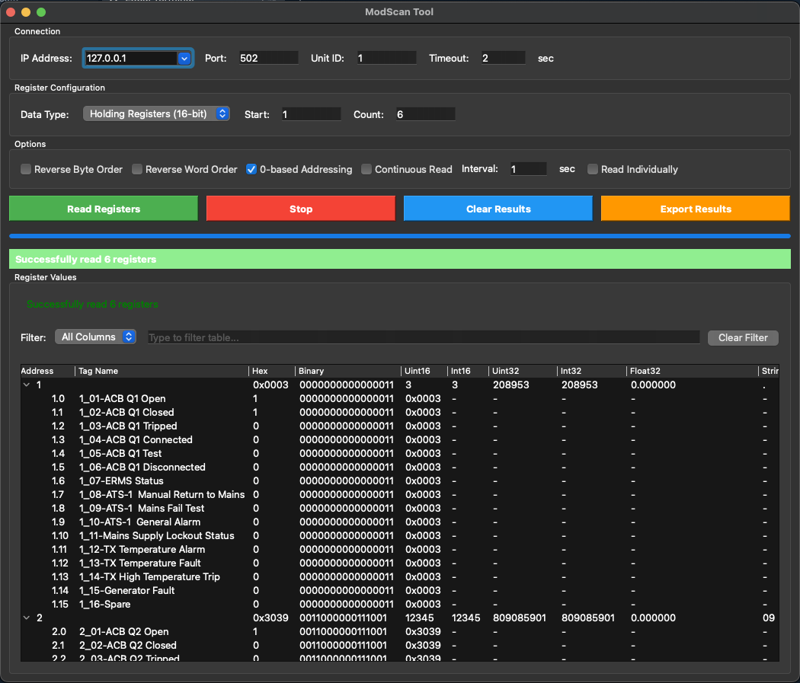

# ModScan Tool

A modern, cross-platform GUI application for reading and monitoring Modbus TCP devices. Built ontop of pymodbus with PyQt6 and PyInstaller.




## Features

### 📊 Comprehensive Data Type Support
Read and interpret Modbus data in multiple formats:
- **Holding Registers** (16-bit read/write) - Function Code 3
- **Input Registers** (16-bit read-only) - Function Code 4
- **Coils** (1-bit read/write) - Function Code 1
- **Discrete Inputs** (1-bit read-only) - Function Code 2

### 🔢 Multi-Format Value Display
View register values in 8 different formats simultaneously:
- **Hex** - Hexadecimal representation
- **Uint16** - Unsigned 16-bit integer
- **Int16** - Signed 16-bit integer
- **Uint32** - Unsigned 32-bit integer (combines 2 registers)
- **Int32** - Signed 32-bit integer
- **Float32** - IEEE 754 floating point
- **String** - ASCII character representation

### ⚙️ Flexible Data Interpretation
- **Reverse Byte Order** - Swap bytes within 16-bit words
- **Reverse Word Order** - Swap word order for 32-bit values
- **0-based/1-based Addressing** - Match your device's addressing convention

### 🔄 Continuous Monitoring
- **Real-time Polling** - Continuously read and update values
- **Configurable Interval** - Set custom polling rates (0.1 to ∞ seconds)
- **Live Table Updates** - Watch values change in real-time

### 🛡️ Robust Error Handling
- **Individual Register Reading** - Continue reading even if some registers fail
- **Error Display** - Failed registers show "ERROR" with hover tooltips
- **Mixed Results** - View successful reads alongside failures

### 🔍 Advanced Filtering
- **Search/Filter Table** - Filter by any column or search all columns
- **Real-time Filtering** - Results update as you type
- **Column-Specific Search** - Target specific data types

### 💾 Export Capabilities
- **CSV Export** - Save results with timestamp
- **All Formats Included** - Exports all data type interpretations
- **Timestamped Files** - Automatic unique filenames

### 🖥️ Modern GUI
- **Native Cross-Platform** - Built with PyQt6
- **Dark Mode Compatible** - Looks great on macOS, Windows, and Linux
- **Resizable Columns** - Adjust table to your preferences
- **Selectable Text** - Copy error messages and values easily

## Installation

### Option 1: Download Pre-built Executable (Recommended)

Download the latest [release](https://github.com/NathanMoore4472/modscan-tool/releases) for your platform:
- **macOS**: `ModScan-Tool-macOS.dmg`
- **Windows**: `ModScan-Tool-Windows.exe`
- **Linux**: `ModScan-Tool-Linux.tar.gz`

No Python installation required!

### Option 2: Run from Source

1. **Clone the repository:**
   ```bash
   git clone https://github.com/NathanMoore4472/modscan-tool.git
   cd modscan-tool
   ```

2. **Create virtual environment:**
   ```bash
   python3 -m venv venv
   source venv/bin/activate  # On macOS/Linux
   # or
   venv\Scripts\activate  # On Windows
   ```

3. **Install dependencies:**
   ```bash
   pip install -r requirements.txt
   ```

4. **Run the application:**
   ```bash
   python modscan_tool.py
   ```

   Or use the convenience scripts:
   ```bash
   ./run.sh        # macOS/Linux
   run.bat         # Windows
   ```

## Usage

### Basic Reading

1. **Configure Connection:**
   - IP Address: Enter device IP (e.g., `192.168.1.100`)
   - Port: Modbus TCP port (default: `502`)
   - Unit ID: Modbus slave ID (typically `1`)
   - Timeout: Connection timeout in seconds

2. **Select Data Type:**
   - Holding Registers (16-bit)
   - Input Registers (16-bit)
   - Coils (1-bit)
   - Discrete Inputs (1-bit)

3. **Configure Register Range:**
   - Start Register: First register address
   - Register Count: Number of registers to read (max 125 for registers, 2000 for bits)

4. **Click "Read Registers"**

### Advanced Features

#### Continuous Reading
Enable "Continuous Read" and set an interval (seconds) to poll the device continuously. Perfect for monitoring live data!

#### Individual Reading
Enable "Read Individually" to read registers one at a time. If a register fails, it shows an error but continues with the next register.

#### Data Interpretation Options
- **Reverse Byte Order**: Swap high/low bytes (for little-endian devices)
- **Reverse Word Order**: Swap word order in 32-bit values
- **0-based Addressing**: Toggle between 0-based (0-65535) and 1-based (1-65536) addressing

#### Filtering Results
Use the filter bar to search for specific addresses or values. Select a column to filter or choose "All Columns" for global search.

## Examples

### Read Temperature Sensor (Float32)
```
IP: 192.168.1.50
Port: 502
Unit ID: 1
Type: Input Registers
Start: 100
Count: 2
```
View the Float32 column for the temperature value.

### Monitor Multiple Coils
```
IP: 192.168.1.51
Port: 502
Unit ID: 1
Type: Coils
Start: 0
Count: 16
Continuous Read: ✓
Interval: 1
```
Watch coil states update every second.

### Scan for Valid Registers
```
Type: Holding Registers
Start: 0
Count: 100
Read Individually: ✓
```
See which registers exist (successful reads) and which don't (errors).

## Technical Details

### Supported Modbus Function Codes
- **FC 01** - Read Coils (1-bit read/write)
- **FC 02** - Read Discrete Inputs (1-bit read-only)
- **FC 03** - Read Holding Registers (16-bit read/write)
- **FC 04** - Read Input Registers (16-bit read-only)

### Protocol Limits
- **Registers**: Max 125 per request
- **Coils/Discrete Inputs**: Max 2000 per request
- **Address Range**: 0-65535 (protocol standard)

### Data Type Conversions
- **16-bit values**: Direct register values
- **32-bit values**: Combines two consecutive registers (big-endian by default)
- **Float32**: IEEE 754 standard, combines two registers
- **String**: Interprets bytes as ASCII characters (printable only)

## Building from Source

See [BUILD_INSTRUCTIONS.md](BUILD_INSTRUCTIONS.md) for detailed build instructions.

### Quick Build

**macOS:**
```bash
./build_macos.sh
```

**Windows:**
```cmd
build_windows.bat
```

**Linux:**
```bash
./build_linux.sh
```

## GitHub Actions

This project includes automated builds for all platforms via GitHub Actions. Every push automatically builds executables for macOS, Windows, and Linux. See [GITHUB_ACTIONS_GUIDE.md](GITHUB_ACTIONS_GUIDE.md) for details.

## Requirements

- Python 3.7 or higher
- PyQt6 >= 6.6.0
- pymodbus >= 3.5.0

See [requirements.txt](requirements.txt) for complete dependencies.

## Platform Compatibility

- ✅ **macOS** - Native .app bundle
- ✅ **Windows** - Standalone .exe
- ✅ **Linux** - Tested on Ubuntu, Debian, Fedora

## Security Note

This tool is intended for authorized network scanning and device communication only. Ensure you have permission to communicate with target devices before use.

## Troubleshooting

### "Connection refused" or timeout errors
- Verify device IP address and port
- Check network connectivity
- Ensure device supports Modbus TCP
- Verify firewall settings

### "Illegal Function" error (Exception Code 1)
- Try switching between Holding/Input registers
- Check device documentation for supported function codes
- Verify register addresses exist

### Values show as "ERROR"
- Enable "Read Individually" to see which specific registers fail
- Check register addresses in device documentation
- Some registers may not exist in the range

### macOS: "ModScan Tool” Not Opened"

When you first try to open the app, macOS may block it. To allow the app to run:

**Option 1: Using System Settings (Recommended)**
1. Try to open the app (you'll get the blocked message)
2. Open **System Settings** → **Privacy & Security**
3. Scroll down to the **Security** section
4. You'll see a message: "ModScan Tool" was blocked to protect your Mac.
5. Click **Open Anyway**
6. Confirm by clicking **Open Anway** again in the dialog
7. The app should now open

**Option 2: Remove Quarantine Attribute (Terminal)**
```bash
xattr -cr "/Applications/ModScan Tool.app"
```

After using any of these methods once, macOS will remember your choice and won't ask again.

### macOS "App is damaged" warning
If you see "App is damaged and can't be opened", run:
```bash
xattr -cr "/Applications/ModScan Tool.app"
```

### Windows SmartScreen warning
Right-click → Properties → Unblock, or click "More info" → "Run anyway"

## Contributing

Contributions are welcome! Please feel free to submit a Pull Request.

## License

This project is licensed under the GNU General Public License v3.0 - see the [LICENSE](LICENSE) file for details.

This means:
- ✅ You can use, modify, and distribute this software
- ✅ You can use it commercially
- ⚠️ Any modifications must also be released under GPL v3
- ⚠️ You must disclose the source code of modified versions
- ⚠️ You must include the original copyright and license notices

## Author

Nathan Moore

## Acknowledgments

- Built with [PyQt6](https://www.riverbankcomputing.com/software/pyqt/)
- Modbus communication via [pymodbus](https://github.com/pymodbus-dev/pymodbus)
- Cross-platform builds with [PyInstaller](https://www.pyinstaller.org/)

---

**Need help?** Open an issue on GitHub or check the [BUILD_INSTRUCTIONS.md](BUILD_INSTRUCTIONS.md) and [GITHUB_ACTIONS_GUIDE.md](GITHUB_ACTIONS_GUIDE.md) for more details.
